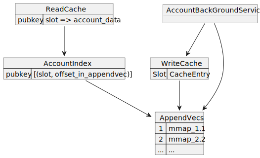

# Solana Accounts DB

AccountsDB manages account's data. Account data, state of the network, a special
implementation of the log-like database - Append-only database. The underlying
storage is `AppendVec`. And the accounts_DB maintains a index with (pubkey, slot)
for lookup of accounts data, and caches.



## AppendVec

All accounts data are stored on AppendVec. AppendVec is a append-only memory
mapped files. One AppendVec stores all the accounts update for a slot. Each
entry in the AppendVec is a key-value pair: (pubkey, account_data).

AppendVec storage file name `<Slot>.<id>`. `id` is unique increasing number.
Historically, a slot can have multiple AppendVec storages. Each replay of a
block will create a new AppendVec file for that slot. However, after introducing
the write cache, all the writes for a slot are first cached and only dumped to
AppendVec after block is rooted. So there will be one appendVec for a slot.

### AncientAppendVec
To reduce the number of AppendVec files, old AppendVec files that are 1-epoch
ago are squashed into AncientAppendVec, which contains all the AppendVec for
`slot < curr-slots_in_epoch`.

## Account-DB index

A different view of the accounts-db to facilitate fast lookup of pubkey and
accounts data history for slots from AppendVecs.

Format:
- pubkey -> SlotList.
- SlotList ->[(slot, offset_in_appendvec)]

Index doesn't store the accounts data, rather it stores the offset in the
AppendVec for the accounts data.

The index is also stored on the disk by memory mapped files.

## Accounts-DB read cache

A read-only cache, which get populated when reading. When writing, updated entries are removed from the cache.
Format:
- (pubkey, slot)-> data

## Accounts-DB write cache

Instead of saving every writes to the account to AppendVec individually when
replay the blocks, a write cache is introduced to hold all the account data
update for a slot. Format:
- slot->(pubkey, accounts).

And the contents of the cached are dumped into AppendVec only during cache flush
- A Batch Stores.

When a block is rooted, the entry (slot, cache_entry) in the cache becomes
candidate to flush.

Account caches are managed by `Accounts-db background service`, which periodically
flush clean and store accounts cache entries into disk AppendVec. It also
perform other maintenance task such as AppendVec cleaning, shrinking and
generate snapshot.

- Cache data structure
```
    slot-->CachedAccounts
             --> (pubkey, account), statistics, flags (is_frozen)
```

## Shrink/Clean in ABS

Cleaning: remove the ref to account on AppendVec from account_index
Shrink: remove/relocate AppendVec storage

As we root banks and slot, slot-list in index will be removed (i.e. clean). More accurately, this is happening on snapshotting. 
pubkey->slot_list: holding the last state and active state for the accounts in the network. 
Let's say Account A is last access at slot S. If no more on going bank access A, only one copy of A at S is needed.
If there are on-going bank access to A, then those slot will be in slot list.
When a bank root, all accounts in the bank will be added to slot-list and all previous slots that are ancestors of the root can be safely cleaned.

Scan append-vec against account-index ref.
Any accounts not refed in account-index can be removed -- old state. Clean will result append-vec shrink (by threshold for live/dead ratio). When all 
dead, the whole slots can be removed.

Shrink will relocate accounts in appendvec, so it need to update account-index to point to the new location.

## Snapshot

State for a particular slots. It include accounts-db: AppendVec storage for accounts. And banks. 
When creating snapshot hardlink to AppendVec storage in snapshot folder to prevent account storage file from being deleted.

update? Shrinking will modify the AppendVec?
If shrinking happens at root 100 + x, snap 100. Then 100 can be modified. then
we can't start at 100 again because accounts will be lost. And too frequent of
root, too frequent scan not good.

So, shrinking only happens at the snap, and it will be fine. Appendvec 100 won't
change until next snap 200. If we crash at 150, then 100 is still good.

