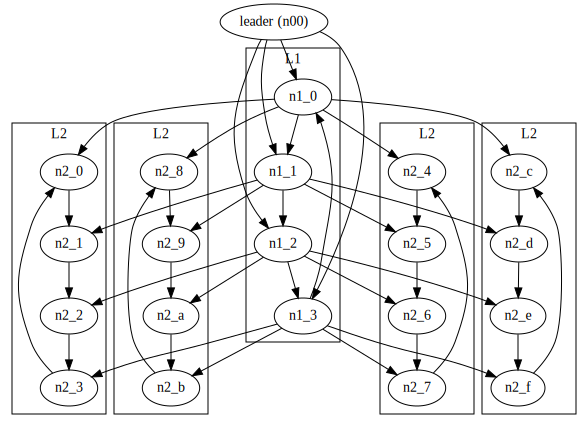

# Solana Shreds

Shreds are used to propagate solana transaction blocks. The maximum number of
shreds that a slot can have is 32K. Each shred comes from a buffer with
capacity for 4 transaction. With 400ms slot time, the peak transaction counts
for solana network is 320K transaction per second.

## Poh ticks

Poh ticks with hash loops. Each tick is a fixed number of hashes. And the
transactions in each tick are record into Entries.

```
struct Entry {
    num_hashes: usize,
    hash: Hash,
    tranactions: Vec<Transaction>,
}

fn tick(prev_hash: Hash) -> Entry {
    let n = 0;
    let hash = prev_hash;
    while n < num_hash {
        hash = hash(hash, hash)
    }
    
    Entry {
        num_hashes,
        hash,
        transaction_buf.drain(),
}


```

A schematic time-line diagram is shown below. On one hand, transactions are
coming, on the other hand the Poh is ticking and record transaction into entries at each tick
boundary. 

```
---------------------------------------------------------------------> time
          |         |             |            |               |
 T1, T2      T3       T4,T5,T6       T7          T8,T9,T10
---------------------------------------------------------------------> time
          e1        e2            e3           e4              e5
```


## Shred generation

The array of [Entry] for a particular block are serialized and chunked into
data shreds. Data shreds feed into Reed-solomon coder to generate parity shred.
Data and coding shreds are stored into blockstore (i.e. rocksdb) and
broadcasted through turbine. The particular Reed-solomon coding is 32:32
redundancy. Data and code have the same number of shreds.

```
// data structure for data shred
struct ShredData {
    common_header: CommonHeader,
    header: DataHeader,
    payload: Vec<u8>, 
}

// data structure for code shred
struct ShredCode {
    common_header: CommonHeader,
    header: CodeHeader,
    payload: Vec<u8>, 
}

// Shred enum (i.e. Union)
enum Shred {
    ShredCode(ShredCode),
    ShredData(ShredData),
}

// Code snippet to dispatch data/code shreds
match shred {
    Shred::ShredCode(shred) => handle_code_shred(shred), 
    Shred::ShredData(shred) => handle_data_shred(shred), 
}
```

### Erasure coding

Reed-solomon coding is to solve the problem of data loss during transmission.
It doesn't check for data corruption. Data corruption can be done with checksum
separately. 

Motivation when transmitting N bits, but one bits is missing. Then by adding
a parity bit, we can recover it. However when 2 bits are missing, adding
2 bits, odd-bit parity and even-bit parity would only be possible to recover
50%. Can't recover when 2 bits fails in the same group. However, if we can add
more parity bits and divide it up into more groups. Then we will be possible to
recover more. The math helps to design such a grouping for parity that can
achieve optimal recovery. The most widely used algorithm is reed-solomon code.
For solana, it use a 32:32 solomon codes for shred.


```
// Maps number of data shreds to the optimal erasure batch size which has the
// same recovery probabilities as a 32:32 erasure batch.
pub(crate) const ERASURE_BATCH_SIZE: [usize; 33] = [
    0, 18, 20, 22, 23, 25, 27, 28, 30, // 8
    32, 33, 35, 36, 38, 39, 41, 42, // 16
    43, 45, 46, 48, 49, 51, 52, 53, // 24
    55, 56, 58, 59, 60, 62, 63, 64, // 32
];

For example, 
    1 --> 18 (17)
    2 --> 20 (18) +
    3 --> 22 (19) +
    4 --> 23 (19) -
    5 --> 25 (20) +
    6 --> 27 (21) + 
    7 --> 28 (21) -
    8 --> 30 (22) +
    9 --> 32 (23) +
    10 -> 33 (23) -
    11 -> 35 (24) +
    12 -> 36 (24) -
    13 -> 38 (25) +
    14 -> 39 (25) -
    15 -> 41 (26) +
    16 -> 42 (26) -
    17 -> 43 (26) - 
    18 -> 45 (27) +
    19 -> 46 (27) -
    20 -> 48 (28) +
    21 -> 49 (28) -
    22 -> 51 (29) +
    23 -> 52 (29) -
    24 -> 53 (29) -
    25 -> 55 (30) +
    26 -> 56 (30) -
    27 -> 58 (31) +
    28 -> 59 (31) -
    29 -> 60 (31) -
    30 -> 62 (32) +
    31 -> 63 (32) -
    32 -> 64 (32) -
```
    
Worst case number of coding shreds are 17 times bigger than the number of data
shreds. Each data shreds will need 17 coding shreds. That's what used for
discarding coding shreds. The fewer the number of data shreds in the erasure
batch, the more coding shreds need to achieve the same probability of recovery.
After 32 data shreds in the erasure batch, the rate for redundance of coding
shreds no longer decrease. 

Mathematically, x - source, y - received. Try to recover X. Missing entries
cause M'. With clever design of the matrix M, after deleting any missing sub
matrix, the resulting M' is still full rank then we will be able to back-out x.

M is the vandermonde matrix.

```
M * x = y
x = inv(M) * y
```
inv is done by gauss-elimination.


encoding is matrix multiply, decoding is also a matrix multiply. 
M - vandermonde matrix; special matrix - every sub-matrix is invertible. 

Lookup table for erasure batches given the number of data shreds

This is for merkle tree. 

Malicious leader can create a partition of the network by sending two different
last data-shreds. So merkle tree of the shred is introduced, each shred must be
long to the merkle tree. must be verifiable. But this leads to the fact that we
must have at least K shreds in the erasure batch to compute the merkle tree,
that leads to the following matrix.

The merkle tree need to be deep enough to prevent the leader from sending two
versions of blocks in the network. Single eraser batch is easy to send two
versions of blocks in the network. By 18 = 64 - (32-1) - (16-1). we will have
a tree of 6 levels that make it harder to create two versions of blocks in the
network.

Fundamentally, merkle tree is to check if an item is in the set. 
Same task you can do with the HashSet but it will require the checker to store
the set. merkle tree offload the set storage to peers, the checker only need to
hold the root hash.


How to calculate recover probability for Reed-Solomon code?

total: n
source: k
parity: n-k
correction: t

t = (n-k)/2  when error not known.

Hamming distance for correction. Find the nearest point in the K subspace.

Erasure: means error location is known. Then RS can correct twice as many as error code (n-k)

32:32 has 16 correction.
1:17 has 8.5 correction, erasure error tolerate 16


```
// Maps number of data shreds to the optimal erasure batch size which has the
// same recovery probabilities as a 32:32 erasure batch.
pub(crate) const ERASURE_BATCH_SIZE: [usize; 33] = [
    0, 18, 20, 22, 23, 25, 27, 28, 30, // 8
    32, 33, 35, 36, 38, 39, 41, 42, // 16
    43, 45, 46, 48, 49, 51, 52, 53, // 24
    55, 56, 58, 59, 60, 62, 63, 64, // 32
];

performance concern:
    how fast to compute and decode steam? rate?
    error correction capability?

```

A blog that gives a working example of RS code
https://levelup.gitconnected.com/reed-solomon-codes-data-recovery-over-unreliable-networks-cbdcf3f029b1

This gives a matrix view of the encoding and decoding.

### generator polynomial view of encoding and decoding
data -> bit string -> polynomial whose coefficient are bits

For example, an 8 – bit word 11001101 is represented by the following polynomial of order 7:

1𝑥7+ 1𝑥6+ 0𝑥5+ 0𝑥4+1𝑥3+ 1𝑥2+ 0𝑥1+1𝑥0 = 𝑥7+𝑥6+ 𝑥3+ 𝑥2+1

- error detection CRC: 
xk * I(x) = Q(x)*g(x) + r(x)  # r(x) is parity bits, transmit I(x) + r(x)
[xk*I(x), r(x)]  transmit polynomial can be divided by g(x), error detection (CRC).

if E(x) is divisible by g(x) then error detection can fail.
    
case: odd number of bit flips  
    E(1) = 1
    G(1) = 0
    G(x) = xk+1 
    
sum(Ck*Xk)*xk /(x+1) remainder sum(Ck) can detect odd bit flips

case: burst k errors
    difference must be by sum(Xk)
    if difference is less than Xk then detect
    circular code: sum up every k symbols --> k parity bits
        
https://www.cs.jhu.edu/~scheideler/courses/600.344_S02/CRC.html

-  polynomial code (use polynomial to compute parity bits)
k-bit source: k-1 polynomials 
code: I(x)*g(x)  divisible  by g(x)

polynomial multiple can be represented as matrix multiply
    - coeff for x^k corresponds to the k-th parity row
factor of xn-1 ==> CRC codes
    - G matrix: column shift according to coefficient of generation polynomial
    - orthogonalize top to identity matrix, then bottom will be parity matrix
    
decoding correction capability 
    - rank of the generation matrix
    - also determinant of the matrix
detailed math
https://math.libretexts.org/Bookshelves/Abstract_and_Geometric_Algebra/Abstract_Algebra%3A_Theory_and_Applications_(Judson)/22%3A_Finite_Fields/22.02%3A_Polynomial_Codes

## Broadcast shreds

Shreds are broadcasted in the network with turbine network layers. 

```
leader --> layer 1 ---> layer 2 ---> layer 3
```



High stake nodes are in layer1.

Also to prevent shreds from lost, retransmit through gossip is also supported.
This is done through are request and response mode. 

## Storage for shreds

Shreds are stored in blockstore - rocksdb in the ledger. The reply and
retransmit look up shreds from the ledger.


## Misc coding tips

From reading rust reed-solomon package
Style for document code. First line - one or two sentence summary for the fn. 
Then paragraph to describe input, output params and exception and panic.
```
    /// Multiply a slice of elements by another. Writes into the output slice.
    ///
    /// # Panics
    /// Panics if the output slice does not have equal length to the input.
    /// Return the element in the slice
    fn mul_slice() -> Element {
        ...
    }
```