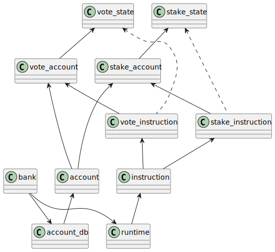

# Solana Stake

In solana cluster, nodes earn rewards through 1. block reward for being the leader; 2. stake/vote rewards at the end of epoch. Normal users can stake sol with stake account. And stake account delegate the sol to vote account. Vote accounts are associated with the validator nodes. vote account earn rewards from the commission. stake account earn rewards from inflation.

## Stake overview diagram

## Vote/Stake account

Vote and stake accounts are special accounts. They share the normal account data. They also have their own special state data. vote_state contains the tower of vote history. stake_stake contains the status of stake delegation.

vote_account has 3 pubkeys,
1. vote_key itself,
2. authorized_vote_key for signing vote instructions, this is normally the same as the node key, which also pays for the voting transactions. With node_key (i.e. fee_paying_key) the same as the vote signing key (authorized_vote_key), vote instruction will only need to be signed by one key. This saves the time for voting transactions.
3. authorized_vote_withdrawer key, used by withdraw instruction to withdraw sols.

stake_account can be in different states
1. uninitiated
2. staked
3. unstaked
stake instruction will transition the stake_states inside stake accounts.

## Class Relations

Storage for vote_account/stake_account are managed by accounts_db. To interact with stake/vote accounts, there are special instructions, vote_instruction and stake_instruction for those accounts. Those instructions are packed into transactions, transmitted on the network, and handled by the runtime. When runtime executes transaction batches, it will pick out the vote/stake transactions and run them separately to update the vote/stake status cache. This is all done in pure rust code, unlike other executable transactions (i.e. executed by the bpf runtime for user supplied code).

Both account_db and runtime are owned by the bank at the highest level.

