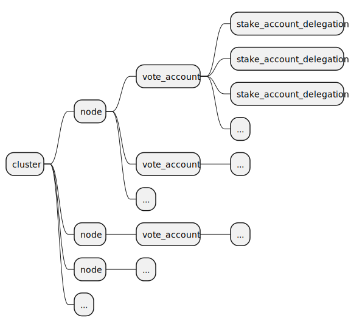

# Solana Stake

In solana cluster, nodes earn rewards through 1. block reward for being the leader; 2. staked vote rewards at the end of epoch. Users can stake sol with stake account. And stake account delegate the sol to vote accounts. Vote accounts are associated with the validator nodes.

## Stake overview diagram

## Vote/Stake account

Vote and stake accounts are special accounts. They share the normal account data. They also have special Sate data. Vote_state contains the tower of vote history. stake_stake contains the info of stake delegation.

vote_account has 3 pubkeys,
1. vote_key itelf,
2. authorized_vote_key for signing vote instructions, this is normally the same as the node key, which pays for the voting transactions. With node_key (i.e. fee_paying_key) the same as the vote signing key (authorized_vote_key), vote instruction will only need to be signed by one key. This saves the time for voting transactions.
3. authorized_vote_withdrawer key, used by withdraw instruction to withdraw sols.

stake_account can be in different states
1. uninitiated
2. staked
3. unstaked

## Relations

Storage for vote_account/stake_account are managed by accounts_db. To interact with stake/vote accounts, there are special instructions, vote_instruction and stake_instruction for those accounts. Those instructions are packed into transactions and transmitted on the network. When runtime execute transaction, it will unpack the instruction and execute them and update the block status. This special runtime is written in rust not bpf runtime (which are used to run bpf code).

Both account_db and runtime are owned by the bank at the highest level.

